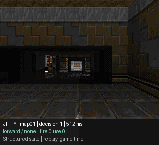
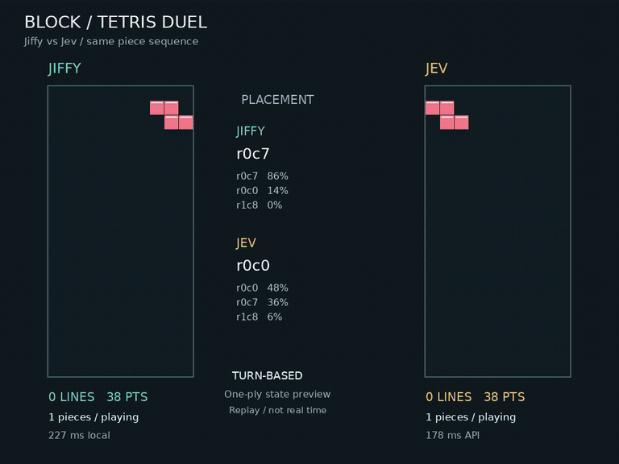

# Demos

Three visual demos of typed model decisions. All consume structured game state;
none of these recordings demonstrates pixel-only control. Run commands from
the repository root. Use a fresh output directory for each recording.

| Demo | Model Control | Status | Instructions |
| --- | --- | --- | --- |
| Doom | Movement, turning, fire, and interaction | Recorded full-level run | [Doom](../doom.md) |
| Tetris | Choose a legal placement with immediate outcome previews | Recorded Jiffy vs Jev match | [Tetris](../tetris.md) |
| Pong | Opposing paddles, simultaneous action decisions | Active development | [Status](#pong) |

## Doom

```bash
pip install -e '.[doom]'
python -m examples.doom --output artifacts/doom-demo --decisions 200
```



Full Freedoom level, not a shooting arena. The recorded run collected 8 items
and scored 2 kills; it did not reach the exit. This GIF is 3x game-time playback.
The simulator pauses during inference, so this is not real-time throughput.

## Tetris

```bash
pip install -e '.[tetris]'
python -m examples.tetris_match --pieces 60 \
  --output artifacts/tetris-match --prompt-key
```



Same 60-piece sequence, independent boards. Jiffy cleared 15 lines and earned
4,540 points; Jev cleared 17 and earned 4,372. Neither topped out. Replay uses
0.5 seconds per piece, not inference wall time. Both models receive unranked,
one-piece outcome previews; this is not a raw-board-only benchmark.

## Pong

The Pong demo is being developed separately. Its runner, dependencies, and
comparison guide will be published when that work is ready.

## Recording Provenance

The README GIFs are compact, reduced-frame-rate versions of actual recordings,
not scripted reenactments. Raw videos, decisions, and probability logs stay under
the ignored `artifacts/` directory. Details and reproduction settings live in each
demo's guide. Single-seed development runs do not establish general model rankings.

| GIF | Source Recording | Display Timing |
| --- | --- | --- |
| `assets/doom.gif` | `artifacts/doom-jiffy-map01-v2/replay-3x.gif` | 3x game-time, 10 fps |
| `assets/tetris.gif` | `artifacts/tetris-jiffy-vs-jev/gameplay.mp4` | Original placement-replay timing, 10 fps |

Earlier six-game experiments are retained in the [archive](../archive/arcade.md).
Their shared helpers are still used by current demos.
